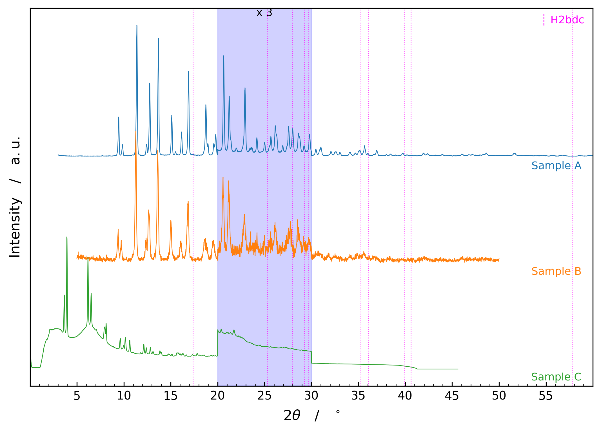

# ACH-PXRD-Quickplot

A one-shot script for plotting stacks of powder X-ray diffractograms from the formats a chemistry lab actually produces — Bruker `.brml`, Riet7 `.dat`, plain `.xy / .txt / .csv`, TOPAS-convertible `.raw`, and simulated `.cif` patterns — all on a single axis.



## Quick start

```
pip install numpy matplotlib pymatgen
cd examples
python ../pxrd_quickplot.py
```

By default the script collects every readable file in the current directory, normalises each pattern, stacks them, and opens an interactive matplotlib window. Add `-s` to save to a file instead.

## What you'll see

```
$ python pxrd_quickplot.py -s -v -x png --highlights "((20,30,3,blue),(35,45,5))"
[+] Plotting 4 file(s):
    - sample-C_300_001_00000.xy
    - sample-B-F-0.20-dry.dat
    - sample-A-P4-cryst.brml
    - H2bdc.cif
[+] Saved -> PXRD_stack.png
```

The `--highlights` argument zooms the chosen 2θ regions on every trace by the given factor and shades the band:

| Region | Multiplier | Shading colour |
|---|---|---|
| `(20, 30, 3, blue)` | × 3 | blue |
| `(35, 45, 5)` | × 5 | red (default) |

The `--reflections` argument overlays the strongest simulated peaks of one or more CIFs as fine dotted vertical lines, useful for flagging suspected impurity phases:

```
python pxrd_quickplot.py -s -x png -r "(H2bdc,10),(other_phase,5,#aa0000)"
```

Each set gets a small colour-coded label just inside the top-right corner of the plot. Bare CIF names resolve against `CIF_LOC` first, then the current directory.

## CLI reference

| Flag | Default | Purpose |
|---|---|---|
| `-i`, `--input PATH ...` | (cwd glob) | Explicit files to plot. Bare CIF names resolve against `CIF_LOC` too. |
| `--stack` | on | Stack all collected patterns on one axis. |
| `-l`, `--limit_extension EXT ...` | off | Restrict the cwd glob to specific extensions (without the dot). |
| `-m`, `--highlights "((a,b,N,color),...)"` | off | Zoom-scale 2θ intervals by `N` and shade them. Colour optional. |
| `-r`, `--reflections "(CIF,N,color),..."` | off | Overlay the N strongest reflections of one or more CIFs as fine dotted vertical lines. `N` defaults to 10, colour to a distinct hue not used by the data traces. CIF names resolve against `CIF_LOC` too. |
| `--labels LABEL ...` | off | Per-trace labels, in input order. Use `_` in a slot to keep that trace's filename stem. |
| `--order i,j,k,...` | off | Reorder the stack top-to-bottom by input index. The i-th value is the input index drawn at position i; e.g. `0,2,1,3` keeps input 0 on top, then draws inputs 2, 1, 3 below it. |
| `-t`, `--title [TEXT]` | off | Set a title; `-t` alone auto-generates one from the filenames. |
| `--size W H` | `7 5` | Plot size in inches. |
| `-x`, `--extension EXT` | `svg` | Output extension when saving. |
| `--dpi N` | `300` | DPI for raster outputs. Ignored for vector formats. |
| `--broadening FWHM` | `0.1` | Lorentzian FWHM (°2θ) used to simulate CIF patterns. |
| `-s`, `--silent` | off | Save to file without opening the window. |
| `-v`, `--verbose` | off | Print the file list and a few diagnostics. |

## What it does

- **Plots stacks of PXRD patterns** from `.xy / .txt / .csv / .dat / .raw / .brml / .cif` files in the current directory, or from an explicit list of paths.
- **Reads each format properly.** `.brml` archives are unzipped and parsed from `RawData0.xml`. Riet7 `.dat` headers are parsed with the date line skipped (so the date isn't accidentally swallowed as the first three intensities). `.xy`/`.txt`/`.csv` go through a tolerant whitespace reader that rejects ragged-column files with a clear message instead of crashing the run.
- **Simulates CIF patterns** with pymatgen's `XRDCalculator`, convolved with a Lorentzian of `--broadening` FWHM (default 0.1°). The 2θ range of the simulated pattern is automatically tied to the global x-range of the measured data so the phases line up.
- **Normalises and offsets** each pattern (individual normalisation by default; CENTER stacking centred around y=0).
- **Highlights with multiplications.** `--highlights "((a,b,N,color),...)"` scales each trace's intensity by `N` inside the band `[a, b]`, draws a translucent shaded rectangle, and labels the band `x N` at the top — useful for showing low-intensity features.
- **Reflection markers from CIFs.** `--reflections "(CIF,N,color),..."` overlays the `N` strongest simulated reflections of one or more crystal structures as fine dotted vertical lines (default `N` = 10, default colours a small palette of distinct hues — `black, magenta, teal, goldenrod, darkviolet` — chosen to differ from the data trace colours). Each set gets a small colour-coded label just inside the top-right corner. Handy for flagging suspected impurity phases in a measurement.
- **Custom labels and stack order.** `--labels` sets per-trace labels in input order (`_` keeps a trace's filename stem); `--order` rearranges the stack top-to-bottom by input index. Colours stay attached to their source file through a reorder.
- **Auto-margins.** Y-limits are computed from `ax.dataLim` and padded by configurable top/bottom fractions (5% default) so peaks don't touch the frame.
- **Robust to bad files.** A file that fails to read prints `[!] Skipping <path>: <reason>` and the rest of the batch carries on. Unrecognised extensions, empty files, corrupt ZIPs, malformed CIFs, etc. are all caught.

## Installation

Python 3.10+. Dependencies:

- `numpy`
- `matplotlib`
- `pymatgen` (only required if you plot CIFs; the script imports it lazily inside `read_cif`)

```
pip install numpy matplotlib pymatgen
```

`.raw` support shells out to TOPAS7's `tc.exe` at `C:\TOPAS7\tc.exe` — edit `TC_PATH` inside `read_raw` if yours lives elsewhere.

## Project layout

```
ACH-PXRD-Quickplot/
├── pxrd_quickplot.py          # the whole program — CLI, readers, plotting
├── examples/
│   ├── sample-A-P4-cryst.brml        # Bruker measurement
│   ├── sample-B-F-0.20-dry.dat       # Riet7 measurement
│   ├── sample-C_300_001_00000.xy     # plain two-column data
│   ├── H2bdc.cif                     # CIF for simulated pattern
│   └── screenshot.png                # the screenshot used in this README
├── .gitignore
├── .gitattributes
└── README.md
```

## Copy-paste recipes (manual customisation)

For one-off plots that need more than CLI flags can express — explicit input order, per-trace colours and labels, structured highlight/reflection lists, locked axes — copy `pxrd_quickplot.py` into your project folder and edit the `OVERRIDES` dict near the top:

```python
OVERRIDES = {
    'inputs':        ['sample_A.xy', 'sample_B.brml', 'phase.cif'],
    'trace_colors':  ['tab:blue', '#cc0000', None],          # None = default cycle
    'trace_labels':  ['Sample A', 'Sample B', 'Reference'],  # None entries = filename stem
    'order':         [0, 2, 1],                              # stack top->bottom by input index
    'highlights':    [(20, 30, 3, 'blue'), (35, 45, 5, None)],
    'reflections':   [('H2bdc', 10, 'magenta'), ('Other', 5, 'teal')],
    'x_range':       (5, 50),
    'title':         'sample-A..D amorphous series',
    'figsize':       (10, 6),
    'extension':     'png',
    'silent':        True,
}
```

Anything set to a non-`None` value overrides BOTH the CLI flag and the SETTINGS default, so the customised copy reproduces the plot from a bare `python pxrd_quickplot.py` invocation. Leave fields as `None` to keep CLI-driven behaviour. This pairs well with the shim from "Run from anywhere" below — the shim stays generic, the per-project copy is the recipe.

## Run from anywhere (optional)

Make the script globally invokable on Windows with a one-line `.cmd` shim placed in a folder on your `PATH`. After this you can type `pxp …` from any directory.

Create `pxp.cmd` containing:

```bat
[PYTHON_CMD] "[FULL_PATH]\pxrd_quickplot.py" %*
```

- `[PYTHON_CMD]` — `python` (or `py` if you use the launcher).
- `[FULL_PATH]` — the absolute path to this repo, e.g. `C:\Users\<you>\Documents\Github\ACH-PXRD-Quickplot`.
- The folder containing `pxp.cmd` has to be on your Windows `PATH`. If you don't already have one, a conventional choice is `C:\Users\<you>\bin\` — create it, drop `pxp.cmd` inside, then add that folder to `PATH` via *System Properties → Environment Variables*.

Then:

```
cd some_data_folder
pxp -s -x png
```

works from any prompt.

## How it works

<details><summary>Click to expand</summary>

**Reader dispatch.** `read_any(path)` looks at the extension and routes to one of seven readers via the `READERS` dict. Each reader returns a 1-D `(x, y)` numpy pair on success or raises a descriptive `Exception` on failure; the main loop wraps every call in a `_safe_read` helper that catches anything, logs the file plus the error, and moves on. A `_validate` step rejects empty arrays, mismatched lengths, all-NaN intensities, and other "successful read but unusable" cases before they reach the plotter.

**Brml.** Bruker `.brml` files are zip archives. The reader opens the archive, finds the first `Experiment0/RawData<N>.xml`, and pulls 2θ and intensity out of every `<Datum>` row — each is `timePerStep,1,2theta,theta,intensity`. Only columns 2 and 4 are kept.

**Riet7 .dat.** The header line matches `<start> <step> <stop> MeasureDateTime <date> <time>`. The parser captures the three floats, then **skips to the next newline** before scanning for intensities — without that step the date digits (`21/05/2024 03:45`) get eaten as the first five intensities, producing a visible spike at the start of the trace. If the Riet7 header isn't found, the reader falls back to the generic two-column `read_xy`.

**CIF.** Lazy-imports `pymatgen` and simulates a powder pattern. To make the simulated trace overlay cleanly on the measured ones, the 2θ range is restricted to the global min/max of all non-CIF traces (so the CIF doesn't stretch the x-axis out to 90°). Each reflection contributes `I_i · (γ/2)² / ((x − x0_i)² + (γ/2)²)` on a step ≈ FWHM/10 grid; the sum is normalised to 1.

**Two-pass main loop.** Non-CIF files are read first to determine the global x-range. CIFs are then simulated within that range. This is what lets a simulated pattern visually align with the measured data instead of dwarfing it.

**Normalisation and offsetting.** Two-stage. `normalize_traces` runs first — `GLOBAL` divides everything by the largest peak across all traces, `INDIVIDUAL` (default) scales each trace to its own max. Then `offset_traces` stacks the normalised traces: `CENTER` (default) distributes them around y=0, `TOPDOWN` starts at y=0 and stacks downward.

**Highlights / multiplications.** Parsed from the `--highlights` string with `re.findall(r'\(([^()]*)\)', spec)`, then for each `(a, b, N, color)` tuple the script multiplies y inside `[a, b]` *around each trace's baseline* (so the multiplication doesn't shift the zero level) and overlays a translucent `axvspan` plus an `x N` label at the top of the axes.

**Reflection markers.** `--reflections` parses with the same tuple-grammar regex. Each `(name, N, color)` triple resolves the CIF (literal path → CIF_LOC → with/without `.cif` extension), runs pymatgen's `XRDCalculator.get_pattern` restricted to the global x-range, sorts the peaks by intensity descending, takes the top `N`, and draws each remaining peak as an `axvline` in the chosen colour with `linestyle=':'`. A small colour-coded label is placed just inside the top-right corner (axes coords `(1 − inset, (1 − inset) − i·step)`, `va='top'`) so multiple sets stack downward inside the plotting box rather than spilling over the top frame. The default reflection palette (`black, magenta, teal, goldenrod, darkviolet`) is kept disjoint from the data trace cycle (`tab:blue/orange/green/red/purple/brown/pink/olive/cyan`) so a dotted reflection line never reads as a data trace. Earlier versions used shades of gray, but at a thin dotted line width those are indistinguishable from each other and from black — distinct hues solve that.

**Y-limits and labels.** After plotting, `ax.dataLim.y0/y1` gives the true extents; **the stacking baselines are also folded in** (`min(baselines)`, `max(baselines)`) so the margin pad always extends below the lowest baseline — important for traces with high amorphous background where `dataLim.y0` sits well above the mathematical baseline that the label is anchored to. Then those bounds are padded by `margin_top` / `margin_bottom` fractions of the resulting range (5% each by default). After labels are placed, the figure is drawn once, each label's bbox is converted to data coords, and the lower y-limit is nudged downward if any label still hangs out — a belt-and-braces check that handles unusual font sizes and figure dimensions. Trace labels themselves sit just *below* each baseline near the right edge — the dead zone of any positive-only PXRD trace — coloured to match the trace.

**Labels, colours, and ordering.** These are resolved in input order — labels (`--labels` / `OVERRIDES['trace_labels']`, with `_`/`None` meaning "keep the filename stem"), then per-trace colours (`OVERRIDES['trace_colors']` or the default cycle by input index) — so each stays attached to its source file. Only then is the reorder (`--order` / `OVERRIDES['order']`) applied, permuting traces and colours together before `offset_traces` assigns the top-to-bottom baselines. The order list must be a permutation of `0..n-1` over the successfully-read traces; an invalid one warns and falls back to natural order.

**OVERRIDES.** A dict at the top of the script holds optional overrides that win over both CLI flags and SETTINGS defaults. `main()` calls `_apply_overrides_to_args()` first to push the simple ones (`title`, `figsize`, `extension`, `silent`) onto the argparse `args` namespace, then reads the structured ones (`inputs`, `trace_colors`, `trace_labels`, `order`, `highlights`, `reflections`, `x_range`) directly from `OVERRIDES` at the relevant points in the plotting flow. This means a customised copy of the script is a self-contained plot recipe: `python pxrd_quickplot.py` with no flags reproduces the customised plot.

</details>

## Authorship and history

This project was originally written by **[@p3rAsperaAdAstra](https://github.com/p3rAsperaAdAstra)** as `PXRD_Plotter.py`. The original was a skeleton script with the readers, CLI parser, and main loop sketched out as TODO comments — the design and the file-format knowledge are entirely the original author's.

In May 2026 the script was **completed and refactored by Claude (Anthropic's AI assistant)** at the author's direction. The user-visible changes:

- All file readers fleshed out: `.xy / .txt / .csv` with comment-skipping and ragged-row rejection, `.dat` with Riet7 header parsing + xy fallback, `.brml` with zip-archive + `<Datum>` parsing, `.raw` with the TOPAS shell-out path preserved, `.cif` with pymatgen + Lorentzian broadening.
- Bug fixes carried over from the skeleton: `defaults` → `DEFAULTS` argparse references, duplicate `read_brml` definition, undefined `get_xy` in `read_raw`, missing `x, y` return in `read_Riet7`, the Riet7 date-line "phantom spike" at the start of `.dat` traces.
- Full main loop: collection of files from cwd (or `-i`), normalisation (`GLOBAL` / `INDIVIDUAL`), offsetting (`CENTER` / `TOPDOWN`), highlight processing, plotting, and silent-mode save.
- `--highlights` argument with both intensity multiplication and translucent band shading.
- CIF simulation tied to the global x-range of the measured traces, so phases overlay correctly instead of stretching the x-axis.
- Y-limits derived from `ax.dataLim` with configurable top/bottom margin fractions.
- Trace labels placed below each baseline in matching colour, inside the empty region of the plot.
- Defensive read pipeline: `_safe_read` + `_validate` so a single bad file logs a skip and the rest of the batch still plots.

The choice of formats, the highlight syntax, and the overall plotting concept are all from the original. The rewrite is filling in and hardening; this note exists for transparency about what's human-authored vs. AI-authored.
